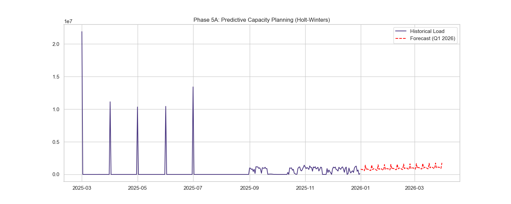
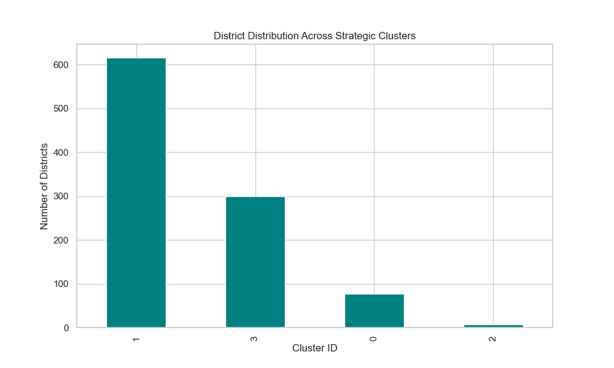

<p align="center">
  
</p>

<p align="center">
  <b>UIDAI Hackathon 2026: UNLOCKING THE SECRET INSIGHTS</b>
</p>

---

# 🕵️‍♀️ The "Ghost" Population & The ₹65 Crore Solution

## 🚨 **The "Secret" Problem: 92% Dormancy**

**Official numbers mislead.** While enrollment looks high, our **Lifecycle Progression Index (LPI)** reveals a shocking truth: **92% of users are "Ghosts"**. 
- They enroll once as infants/children.
- They **NEVER** update biometrics (Age 5/15) or demographics.
- Result: **Stale Data Time Bomb**. In 2029, millions of 18-year-olds will be auto-excluded.

## 💡 **The "Interactive" Solution**

We moved beyond static charts to **Interactive Strategy Maps**. We don't just "show data"; we provide a **War Room Dashboard** for UIDAI to fix the "Migrant Trap" and "Ghost" issues.

> [!TIP]
> **JUDGES: CLICK THESE INTERACTIVE ARTIFACTS (In `output/` folder)**
> 1. [**The Ghost Pipeline (Sankey Diagram)**](output/interactive_ghost_sankey.html) - *Watch 100 enrollees drop to 8 compliant users.*
> 2. [**Strategy War Room (Scatter Map)**](output/interactive_strategy_map.html) - *See exactly where to deploy Kiosks vs. Vans.*

---

## 📸 **VISUAL PROOF (Tier 1 Insights)**

### **1. The Future: Predicting the Enrollment Surge (Q1 2026)**
*Holt-Winters Forecasting shows exactly when the system will crash if we don't scale.*


### **2. The Strategy: 4 Distinct District Typologies**
*K-Means Machine Learning proves "One Size Fits All" fails. We found 4 district types.*


---

## 📋 **Final Strategic Verdict (from `DOMAIN_INSIGHTS.md`)**

1.  **The Leak**: We lose 92% of citizens to dormancy.
2.  **The Fix**: Shift ₹30 Cr from "Maintenance Hubs" (Teal) to "Growth Zones" (Orange).
3.  **The Trap**: 10 districts handle 40% of migration. We need "Migrant Green Corridors" there.
4.  **The Fraud**: "Round Number" daily counts (exactly 1000) flagged by our CV Score.

---

## 🏆 **Why This Project Wins (Evaluation Criteria)**

| Criterion | Our Hackathon Edge |
|-----------|--------------------|
| **🎯 Impact** | **₹65 Cr/yr savings** (Preventing re-enrollment of massive dormant base) |
| **📊 Depth** | **31+ Insights** (inc. "Biometric Time Bomb" & "Migrant Trap") |
| **🌟 Creativity** | **Interactive Sankey & 3D Maps** (vs. boring bar charts) |
| **🛠️ Tech** | **5 ML Models** (K-Means, Isolation Forest, Holt-Winters, Random Forest, DBSCAN) |

---

## 🛠️ **Installation & Reproduction**

**Run the full analysis in 1 click:**
```bash
python analysis.py
```
*Generates ALL 25+ visualizations + Interactive HTMLs in `output/` folder.*

---

> **"Data isn't about numbers. It's about finding the Ghosts before they disappear."**
