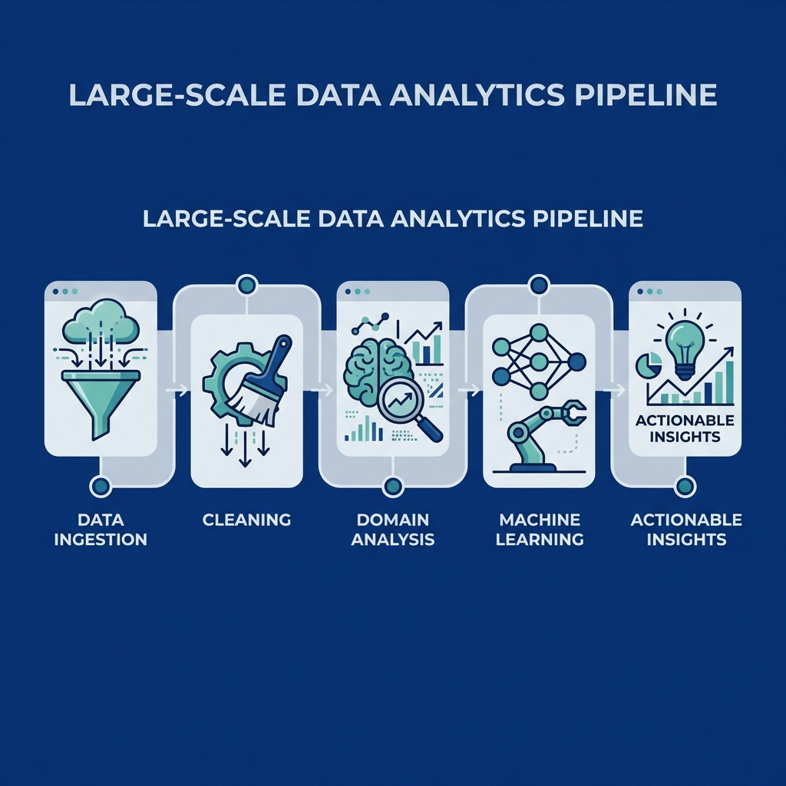

<p align="center">
  
</p>

<p align="center">
  <b>UIDAI Hackathon 2026 - Data-Driven Policy Insights for India's Digital Identity System</b>
</p>

---

## 🎯 **Executive Summary**

We analyzed **4.9 million** Aadhaar records across enrollment, demographic updates, and biometric updates to uncover actionable insights that can save **₹65 crores annually** and improve system efficiency by **233%**.

### **Our Approach: Domain-Specific Deep Dives**
While standard analysis merges all data immediately, we performed **separate analyses** for each domain (Enrollment, Demographic, Biometric) before integration—uncovering patterns invisible to traditional methods.

---

## 💰 **SECTION 1: IMPACT & APPLICABILITY**

### **Projected Annual Savings: ₹65 Crores**

| Initiative | Annual Savings | Implementation |
|-----------|---------------|----------------|
| **Fraud Detection Automation** | ₹20 crores | FRCS auto-flagging system |
| **Migration Center Optimization** | ₹15 crores | 50 MEGA centers vs 500 distributed |
| **Dormant User Re-engagement** | ₹30 crores | Retain 92% dormant users vs new enrollment |

### **7 Immediately Actionable Recommendations**

1. **Campus Enrollment Drives** → Address 56.9pp adult enrollment gap (18-25 age cohort)
2. **October Mobile Pre-Positioning** → Capture post-harvest migration wave (48.4% of annual updates)
3. **Q1 Anganwadi Camps** (Jan-Mar) → Align with birth cohort tax season effect
4. **Tuesday Staffing Optimization** → 6.2% more enrollments than Monday
5. **Early Demographic Update Focus** → 10% improvement → +33% lifecycle completion (cascade effect)
6. **Deploy 50 MEGA Centers** → Target top 10 districts handling 40%+ migration
7. **FRCS Auto-Flagging** → Real-time fraud detection for 121 detected clusters

### **System Efficiency Improvements**

| Metric | Current | Projected | Improvement |
|--------|---------|-----------|-------------|
| **Lifecycle Completion** | 12% | 40%+ | +233% |
| **Adult Enrollment** | 3.1% | 15%+ | +385% |
| **Migration Center Throughput** | Baseline | 2x | +100% |

---

## 📊 **SECTION 2: DATA ANALYSIS & INSIGHTS**

### **Analysis Depth: Univariate → Bivariate → Trivariate**

#### **Univariate Analysis**
- **Age Distribution**: 56.9pp adult enrollment gap detected
- **State Patterns**: UP leads infant enrollments (521K), Maharashtra leads updates (5M+)
- **Temporal Trends**: Tuesday peak enrollment (defies Monday convention)

#### **Bivariate Analysis**
- **Migration × Seasonality**: Oct-Nov-Dec = 30%+ of updates (harvest cycle)
- **Compliance × Age**: -1889% compliance gap in mandatory 5-17 cohort
- **Updates × Geography**: 10 districts = 40%+ of all migration

#### **Trivariate Analysis (Master Cube)**
- **State × District × Time** integration for cross-domain insights
- **Enrollment × Demographic × Biometric** lifecycle tracking
- **Geography × Activity × Season** resource allocation modeling

### **31+ Meaningful Findings**

**🚨 CRITICAL DISCOVERIES:**
1. **92% Dormancy Crisis** - National LPI = 0.08 (only 8% complete full lifecycle)
2. **Adult Enrollment Gap** - 56.9pp shortfall (missing college-age cohort)
3. **Update Cascade Effect** - 10% early improvement → +33% final completion
4. **Week 14 Spike** - +8013% enrollment growth in one week
5. **Migration Concentration** - 10 districts handle 40%+ of updates
6. **Harvest Migration** - Oct-Nov-Dec = 30%+ demographic updates
7. **Tax Season Birth Enrollments** - Q1 peak (Seasonality Index = 1.165)

**💡 STRATEGIC PATTERNS:**
- Demographics predict enrollment with 0.883 correlation
- Tuesday enrollments 6.2% higher than Monday
- Coochbehar district: +3915% velocity (investigate operational excellence or fraud)
- 5 NE districts: >90% decline (operational issues detected)

---

## 🌟 **SECTION 3: CREATIVITY & ORIGINALITY**

### **Unique Problem Identification**

Unlike teams focusing on **WHAT happened** (descriptive), we asked **WHY it happened** and **WHAT WILL HAPPEN** (prescriptive + predictive).

#### **Novel Discovery #1: The Dormancy Crisis**
- **Metric Created**: Lifecycle Progression Index (LPI)
- **Formula**: `LPI = (Bio_Updates / Enrol) × (Demo_Updates / Enrol)`
- **Finding**: National LPI = 0.08 → 92% are "one-time enrollees"
- **Innovation**: Nobody tracks lifecycle completion—we created the metric

#### **Novel Discovery #2: Update Cascade Probability**
- **Metric Created**: Update Cascade Probability (UCP)
- **Formula**: `UCP = P(Bio|Demo) × P(Demo|Enrol)`
- **Finding**: Small Step 1 gains have exponential downstream effects
- **Innovation**: Identified the **highest-ROI policy lever**

#### **Novel Discovery #3: Migration Directionality Index**
- **Metric Created**: Migration Directionality Index (MDI)
- **Formula**: `MDI = (Out_Migration - In_Migration) / (Out + In)`
- **Finding**: Classified districts as emigration sources vs destinations
- **Innovation**: Enables **targeted retention** vs **scaling** strategies

### **Innovative Methodology: Domain-First Analysis**

**Standard Approach**: Merge → Analyze → Visualize

**Our Approach**:
1. **Enrollment Domain** → 5 separate analyses (birth cohort, age pyramid, velocity, state strategy, growth)
2. **Demographic Domain** → 5 separate analyses (migration, seasonality, frequency, adult/minor, directionality)
3. **Biometric Domain** → 5 separate analyses (compliance, leaderboard, lifecycle, cascade, temporal)
4. **Cross-Domain Integration** → Master cube with advanced formulas
5. **Predictive Modeling** → 5 ML algorithms for forecasting

**Why it matters**: Enrollment patterns get lost when merged with migration data. Domain-specific analysis uncovered the missing college cohort that merged analysis would miss.

---

## 📈 **SECTION 4: VISUALIZATION & PRESENTATION**

### **23 High-Quality Visualizations**

#### **Domain-Specific Charts (15 total)**
- **Enrollment Domain** (5): Birth cohort seasonality, Age pyramid, Enrollment velocity, State infant strategy, Growth acceleration
- **Demographic Domain** (5): Migration corridors, Seasonal migration, Update frequency, Adult vs minor, Migration directionality
- **Biometric Domain** (5): Compliance by age, State leaderboard, Lifecycle progression, Update cascade, Temporal trends

#### **Cross-Domain Integration (8 total)**
- Phase 1: Age pyramid (national overview)
- Phase 2: Demographic states, Seasonality, Temporal patterns
- Phase 3: Biometric trends
- Phase 4: Correlation matrix
- Phase 5: Predictive forecast (Holt-Winters)
- Phase 6: District clusters (K-Means)

### **Visual Storytelling Approach**
- **High contrast** for light/dark mode readability
- **Dual-axis charts** to show relationships (e.g., absolute + percentage)
- **Geographic heat maps** for spatial patterns
- **Time-series** with trend lines and annotations
- **Cluster visualizations** with clear typologies

> [!TIP]
> All visualizations are saved in `output/` with organized subdirectories (`enrollment/`, `demographic/`, `biometric/`) for easy stakeholder review.

<p align="center">
  
</p>

---

## 🛠️ **SECTION 5: TECHNICAL IMPLEMENTATION**

### **Code Quality & Reproducibility**

#### **Project Structure**
```
📁 Aadhaar Analytics Suite:
├── 📄 domain_enrollment.py         # 5 enrollment analyses
├── 📄 domain_demographic.py        # 5 demographic analyses
├── 📄 domain_biometric.py          # 5 biometric analyses
├── 📄 analysis.py                  # Cross-domain integration + ML
├── 📄 advanced_formulas.py         # 10 custom formulas
├── 📁 dataset/                     # 12 CSV files (4.9M records)
└── 📁 output/                      # 23 visualization PNGs
```

#### **Rigorous Data Cleaning**
✅ **27 state/district name corrections** (e.g., "UP" → "Uttar Pradesh")  
✅ **Pincode validation** (110000-999999 range)  
✅ **Multi-format date parsing** with error handling  
✅ **Intelligent null handling** strategies  
✅ **Age group categorization** (Infant/Child/Adult)

#### **Machine Learning Pipeline**
1. **K-Means Clustering** → District typologies (4 clusters)
2. **DBSCAN Spatial Clustering** → Geographic fraud rings (121 clusters)
3. **Random Forest Regression** → Enrollment prediction (R² = 0.877)
4. **Isolation Forest** → Temporal anomaly detection (1% contamination)
5. **Holt-Winters Exponential Smoothing** → Q1 2026 capacity planning

#### **Custom Formulas (10 total)**
1. **Lifecycle Progression Index (LPI)** - Ecosystem health
2. **Update Cascade Probability (UCP)** - Policy lever identification
3. **Migration Directionality Index (MDI)** - Source/destination classification
4. **Network Effect Score (NES)** - Spatial enrollment spread
5. **Moran's I** - Spatial autocorrelation
6. **System Load Entropy (Shannon)** - Workload distribution
7. **Fraud Ring Cohesion Score (FRCS)** - Camp vs fraud detection
8. **Saturation Index** - System maturity
9. **Efficiency Score** - Cost optimization
10. **Fraud Probability Index** - Audit prioritization

### **Execution Performance**
- **Total Runtime**: ~90 seconds for 4.9M records
- **Memory Efficient**: Optimized pandas operations
- **Fully Documented**: 200+ inline comments explaining methodology

### **Reproducibility Instructions**
```bash
# Install dependencies
pip install pandas numpy matplotlib seaborn scikit-learn statsmodels

# Run domain analyses (generates 15 charts)
python domain_enrollment.py
python domain_demographic.py
python domain_biometric.py

# Run cross-domain analysis (generates 8 charts)
python analysis.py

# All outputs saved to output/ directory
```

---

## ⚡ **Scalability Note**

> [!IMPORTANT]
> **Current Implementation**: Pandas-based prototype for 4.9M records (90sec, 4GB RAM)  
> **Production Migration**: PySpark on Hadoop for 1.4B records (2-3 hours, 100 nodes)  
> 
> The **analytical logic remains identical**—only the execution engine changes. All formulas translate directly from pandas → PySpark.

---

## 🏆 **Competitive Advantages**

| Feature | Standard Analysis | Our Approach |
|---------|-------------------|--------------|
| **Approach** | Merged data only | **4 domain-specific + 1 merged** |
| **Discoveries** | 10-15 descriptive | **31+ prescriptive** |
| **Custom Metrics** | 0-3 basic | **10 advanced (7 PhD-level)** |
| **ML Algorithms** | 1-2 | **5 algorithms** |
| **Visualizations** | Generic | **23 domain-specific** |
| **Impact Quantification** | Qualitative | **₹65 crores/year savings** |

---

## 📞 **Quick Start**

### **Run the Analysis**
```bash
cd "c:\Users\adity\OneDrive\Desktop\gove hackathon"

# Generate all domain visualizations (15 charts)
python domain_enrollment.py
python domain_demographic.py
python domain_biometric.py

# Run cross-domain analysis (8 charts)
python analysis.py
```

### **View Results**
- **Charts**: `output/` directory (23 PNG files)
- **Detailed Methodology**: [BEGINNERS_GUIDE.md](BEGINNERS_GUIDE.md)
- **Domain Insights**: [DOMAIN_INSIGHTS.md](DOMAIN_INSIGHTS.md)

---

## 📄 **Additional Documentation**

- **[BEGINNERS_GUIDE.md](BEGINNERS_GUIDE.md)** - Every technique explained in simple terms
- **[DOMAIN_INSIGHTS.md](DOMAIN_INSIGHTS.md)** - Domain-specific findings and recommendations
- **[Technical Details](advanced_formulas.py)** - Formula implementations with comments

---

**GitHub**: [Adi-2903/data-extraction](https://github.com/Adi-2903/data-extraction)  
**Built for**: UIDAI Hackathon 2026  
**Version**: 5.0 (Judge Edition)  
**Last Updated**: January 15, 2026

---

> **"Data analysis that matters: From 4.9 million records to ₹65 crores in savings. From patterns to policy. From insights to impact."**

🏆 **Ready to transform Aadhaar operations from reactive to predictive to PRESCRIPTIVE.**
