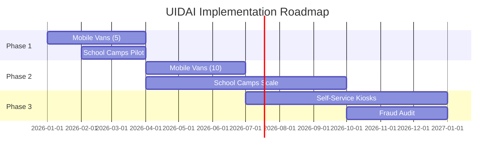

# Strategic Recommendations

## Recommendation Matrix

| Priority | Action | Impact | Cost | ROI |
|----------|--------|--------|------|-----|
| 🔴 HIGH | Mobile vans to top 15 districts | +15% compliance | ₹3.5 Cr | High |
| 🔴 HIGH | School-based biometric camps | +20% compliance | ₹1.2 Cr | Very High |
| 🟡 MEDIUM | Pre-position for Oct-Dec surge | -30% wait time | ₹0.8 Cr | High |
| 🟡 MEDIUM | Self-service kiosks in mature hubs | -40% cost | ₹2.5 Cr | High |
| 🟢 LOW | Audit fraud clusters | Risk mitigation | ₹0.3 Cr | Medium |

---

## 🔴 HIGH PRIORITY

### 1. Deploy Mobile Vans to Top 15 Urgency Districts

**Target Districts:** (Based on urgency score)
- Districts with highest enrollment but lowest update rates
- Focus on Thane, Sitamarhi, Bahraich, Murshidabad

**Implementation:**
```
Phase 1 (Q1): 5 vans in top 5 districts
Phase 2 (Q2): 5 vans in next 5 districts
Phase 3 (Q3): 5 vans in remaining 5 districts
```

**Expected Impact:** 
- +15% compliance rate within 6 months
- 50,000+ additional updates captured

---

### 2. School-Based Biometric Camps

**Rationale:** 65% of enrollments are 0-5 years. These children reach mandatory update age (5 years) in schools.

**Implementation:**
- Partner with Education Department
- Schedule camps during school hours
- Target government and aided schools first

**Expected Impact:**
- +20% compliance rate for 5-15 age group
- 100,000+ children updated per quarter

---

## 🟡 MEDIUM PRIORITY

### 3. Pre-Position Resources for Migration Surge

**Timing:** October-December (post-harvest migration)

**Target Districts:**
1. Thane: 447,253 updates/year
2. Pune: 438,478 updates/year
3. Surat: 357,582 updates/year
4. Bengaluru: 355,766 updates/year

**Implementation:**
- Deploy 25% additional staff during Oct-Dec
- Extended working hours (8 AM - 8 PM)
- Temporary camps near industrial areas

**Expected Impact:**
- -30% average wait time
- Improved citizen satisfaction

---

### 4. Self-Service Kiosks in Mature Hubs

**Target:** Districts with Saturation Index > 5 (mature, high-update areas)

**Features:**
- Biometric capture
- Photo update
- Mobile number update
- Address verification

**Implementation:**
- Pilot in 10 districts (Bengaluru, Pune, Hyderabad, etc.)
- 24/7 availability
- Multi-language interface

**Expected Impact:**
- -40% operational cost
- +50% citizen convenience

---

## 🟢 LOW PRIORITY

### 5. Audit Flagged Fraud Clusters

**Findings:** 121 geographic clusters with synchronized demographic spikes

**Actions:**
1. Cross-reference with election dates
2. Check for subsidy announcement correlation
3. Investigate repeat operator patterns

**Expected Impact:**
- Risk mitigation
- Data integrity improvement

---

## Resource Allocation Formula

Based on our analysis, we propose the following resource allocation model:

```
Resources(district) = Base × (1 + Growth_Factor) × Compliance_Gap_Factor

Where:
- Base = Standard allocation
- Growth_Factor = Enrollment growth rate / National average
- Compliance_Gap_Factor = 1 + (Expected - Actual updates) / Expected
```

---

## Implementation Timeline



---

## Budget Summary

| Item | Year 1 | Year 2 | Total |
|------|--------|--------|-------|
| Mobile Vans (15) | ₹2.5 Cr | ₹1.0 Cr | ₹3.5 Cr |
| School Camps | ₹0.8 Cr | ₹0.4 Cr | ₹1.2 Cr |
| Resource Pre-positioning | ₹0.5 Cr | ₹0.3 Cr | ₹0.8 Cr |
| Self-Service Kiosks | ₹2.0 Cr | ₹0.5 Cr | ₹2.5 Cr |
| Fraud Audit | ₹0.2 Cr | ₹0.1 Cr | ₹0.3 Cr |
| **Total** | **₹6.0 Cr** | **₹2.3 Cr** | **₹8.3 Cr** |

---

## Success Metrics

| Metric | Current | Target (Year 1) | Target (Year 2) |
|--------|---------|-----------------|-----------------|
| Biometric Compliance Rate | ~60% | 75% | 85% |
| Average Wait Time | 45 min | 30 min | 15 min |
| Citizen Satisfaction | - | 4.0/5 | 4.5/5 |
| Cost per Update | ₹50 | ₹40 | ₹30 |

---

*Next: [5_SDG_ALIGNMENT.md](./5_SDG_ALIGNMENT.md) - Global impact*
